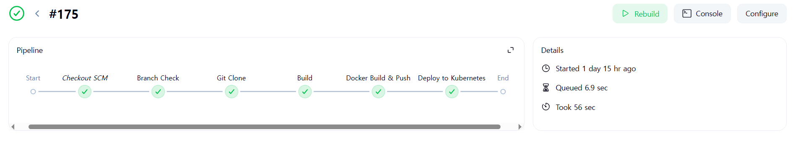

  

---

 

🏃🏻‍♀️ [WHTHIS 데모 사이트 바로가기](https://www.wmthis.n-e.kr) 💨

 

---

#  팀원 구성

  <table>
    <tr>
      <th>서찬영</th>
      <th>천태훈</th>
      <th>오승재</th>
      <th>김유진</th>
    </tr>
    <tr>
      <td></td>
       <td></td>
       <td></td>
       <td></td>
    </tr>
    <tr>
      <td><a href="https://github.com/chan0o0seo">@chan0o0seo</a></td>
      <td><a href="https://github.com/taehoon0518">@taehoon0518</a></td>
      <td><a href="https://github.com/dhtmdwo">@dhtmdwo</a></td>
      <td><a href="https://github.com/kuj7882">@kuj7882</a></td>
    </tr>
  </table>

 

---

# 🔧 기술 스택

### DevOps

&nbsp;
&nbsp;

### CI/CD

&nbsp;
&nbsp;
&nbsp;
&nbsp;

 

---

#  CI/CD의 기대효과

기존의 전통적인 배포 파이프라인은 코드 변경 사항을 커밋하고, 이를 통합한 뒤 빌드 및 배포 준비 과정을 거쳐 실제 배포에 이르는 일련의 단계를 포함합니다.  
이러한 절차는 대부분 수동으로 수행되며, 반복적이고 복잡한 작업으로 인해 통합 과정에서 충돌이 발생하거나 개발자의 실수로 인한 오류가 발생할 가능성이 높았습니다.  
CI/CD는 이러한 문제점을 해결하기 위한 현대적인 소프트웨어 개발 방식입니다.  

이러한 자동화된 파이프라인을 통해 다음과 같은 이점을 기대할 수 있습니다:

1. 배포 프로세스의 자동화로 인한 작업 간소화 및 반복 업무 최소화

1. 통합 시 발생 가능한 충돌 및 실수 감소, 보다 안정적인 소프트웨어 품질 확보

1. 배포에 대한 심리적/업무적 부담 완화, 배포 주기 단축 및 생산성 향상

결과적으로 CI/CD는 개발과 운영의 효율을 극대화하며, 빠르고 신뢰성 높은 배포의 핵심 요소로 작용합니다.

---

# 🗂️ 운영 환경

클러스터 노드 구성

Master 1대 
Worker 5대의 클러스터 구성

### 쿠버네티스 선택 이유

저희는 Kubespray를 활용한 자체 클러스터 환경에서 쿠버네티스를 구축했습니다.  
Kubernetes는 컨테이너 오케스트레이션 툴로, 컨테이너 기반의 마이크로서비스 아키텍처를 운영하는 데 있어 확장성과 유연성이 뛰어납니다.  
특히 서비스의 배포, 스케일링, 장애 복구 등을 자동화하여 운영 부담을 줄여주며, Helm 차트를 활용한 각종 컴포넌트(MariaDB, Ingress Controller, Storage Class 등)의 설치도 손쉽게 이루어졌습니다.

### 젠킨스 선택 이유

Jenkins는 오픈소스 CI/CD 도구로, 다양한 플러그인과 커뮤니티 지원을 통해 커스터마이징이 자유롭습니다.  
저희는 GitHub Webhook을 통해 Jenkins와 연동하고, Push 이벤트 발생 시 자동으로 파이프라인을 실행하도록 설정하여 코드 변경부터 배포까지의 전 과정을 자동화했습니다.  
또한 멀티모듈 구조에 따라 각 모듈별로 변경이 감지될 때만 해당 모듈의 빌드 및 배포가 수행되어 불필요한 리소스 낭비를 줄였습니다.

### 시스템 아키텍처

`클러스터 구성`: Kubespray로 구성된 자체 K8s 클러스터

`Frontend`: Vue + Nginx, Docker 이미지로 빌드 후 K8s에 배포

`Backend`: Spring Boot 기반의 멀티모듈 구조, Kafka를 통한 이벤트 통신

`DB`: MariaDB + PVC

`파일저장`: AWS S3 Presigned URL 기반 외부 저장

`CI/CD`: GitHub + Jenkins + Docker + K8s 배포 자동화

# Blue/Green 배포 사용 이유

무중단 배포를 위해 Blue/Green 전략을 도입했습니다.  
이 전략은 배포 시점에 기존 버전(Blue)과 새 버전(Green)을 동시에 운영하고, 테스트가 완료되면 트래픽을 Green으로 전환하는 방식입니다.  
이를 통해 새 버전에서 문제가 발생하더라도 즉시 이전 버전으로 롤백이 가능하여 서비스 안정성이 크게 향상되었습니다.

# 모니터링 시스템

기술 스택: Prometheus + Grafana

활용 목적:

1. 각 파드의 리소스 사용량(CPU, Memory) 및 응답 속도 모니터링

3. 배포 이후의 성능 변화 확인

# Backend CI/CD 시나리오

### Trigger
GitHub의 각 모듈별 디렉터리 내 변경 감지

### Flow

1. GitHub Webhook → Jenkins 파이프라인 트리거

2. 해당 모듈만 ./gradlew build

3. Docker 이미지 빌드 및 Docker hub에 Push

4. K8s에 해당 모듈 배포 (kubectl rollout restart 또는 Helm upgrade)

### 장점
모듈 단위로 독립 배포 가능 → 빠른 피드백 & 서비스 안정성 향상

# Frontend CI/CD 시나리오

### Trigger
프론트엔드 저장소 변경

### Flow

1. GitHub → Jenkins → npm run build

2. Nginx 기반 Docker 이미지 빌드

3. Docker Hub에 이미지 Push 및 K8s 배포

### Static 파일 구성 
dist/ 디렉터리 → Nginx에 바인딩하여 SPA 배포

# CI/CD 테스트 결과

# ReadMe 바로가기

🔗 [Frontend](https://github.com/beyond-sw-camp/be12-fin-5verdose-WMTHIS-FE/blob/main/README.md)  
🔗 [Backend](https://github.com/beyond-sw-camp/be12-fin-5verdose-WMTHIS-BE/blob/main/README.md)  
🔗 [CI/CD](https://github.com/beyond-sw-camp/be12-fin-5verdose-WMTHIS-BE/tree/main/cicd/README.md)  